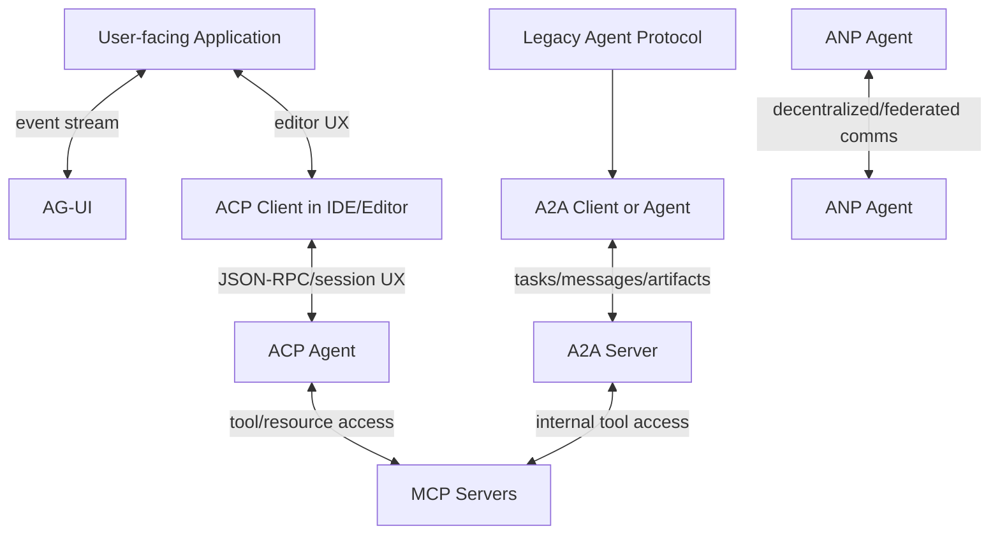
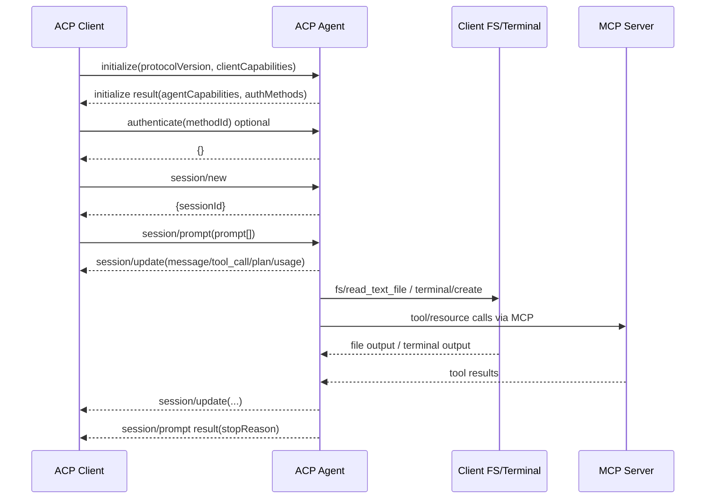
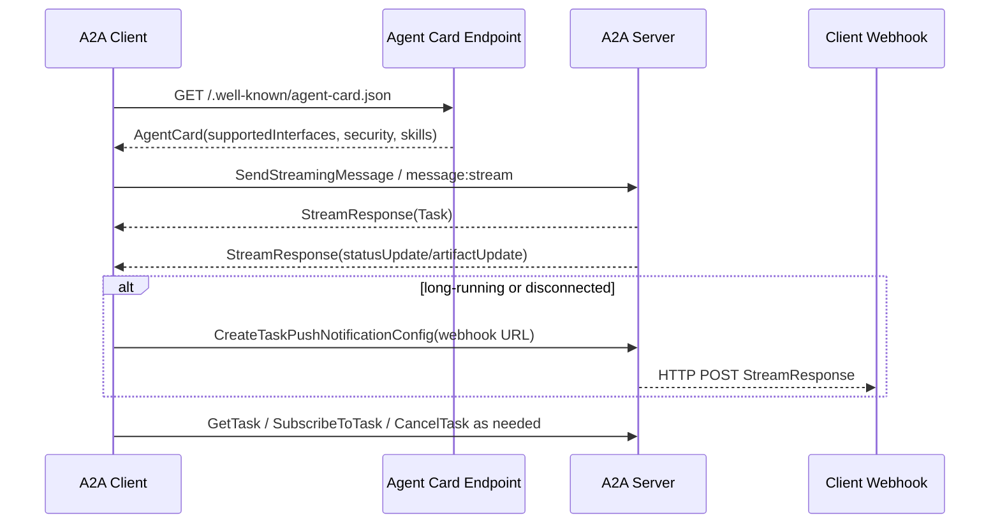

# Agent Interoperability Protocols

## Executive summary

The current agent-protocol landscape is best understood as a **stack of adjacent interoperability layers**, not a single winner-take-all standard. **ACP** is optimized for **editor/IDE ↔ coding-agent** interaction, with session-oriented JSON-RPC, progress streaming, local file/terminal affordances, and UX elements such as tool-call reporting, plans, and permission prompts. **A2A** is optimized for **remote agent ↔ remote agent/client** interaction, with Agent Cards for discovery, long-running tasks, artifacts, multiple transport bindings, and explicit enterprise-facing security schemes. **MCP**, **AG-UI**, and **ANP** are not substitutes for ACP or A2A so much as neighboring protocols that solve different interoperability planes: tools/data access, user-facing event streams, and open/federated agent networking, respectively. citeturn24search0turn24search1turn27search0turn16search1turn29search2turn15view2

For a practical adoption decision: use **ACP** when your primary problem is “how does an IDE or editor drive a coding agent safely and with rich UX?”; use **A2A** when your primary problem is “how do remote agents discover one another, negotiate interfaces, and coordinate long-running work across organizational boundaries?”; add **MCP** when agents need standardized tool/resource access; add **AG-UI** when the user-facing application needs typed, low-latency, bidirectional interaction; and treat **ANP** as a more ambitious, still-evolving option for decentralized/federated agent identity and cross-domain communication. citeturn24search0turn24search1turn27search5turn16search1turn29search2turn30view0turn30view1

Since the user’s prior draft date is unspecified, the most defensible way to answer “what changed?” is to report the material changes visible in the official sources through late June 2026. The most important ones are: **ACP’s rapid 2026 stabilization wave** around session management, config/options, registry, logout, message IDs, usage updates, deletion, and SDK 1.0 milestones; **A2A’s maturation from 0.3 to 1.0 and then 1.0.1**, including cleaner versioning, explicit service headers, stronger extension structure, clearer bindings, and bug-fix releases; and **MCP’s 2026 roadmap work** around scalability/statelessness, registry/discovery, and formal governance, while its current stable spec release remains the November 2025 revision as of the dates captured here. citeturn26view0turn26view1turn26view2turn26view3turn27search1turn8view2turn31search2turn31search8

Two user constraints remain unspecified in the request and therefore materially limit implementation specificity: **target platforms/runtime environment** and **regulatory/compliance requirements**. The prior draft date is also unspecified, so the “since last draft” changelog below should be read as a **best-effort update delta through June 2026**, not a precise diff against a known baseline. citeturn24search0turn27search5

## Scope and framing

ACP and A2A sit in different places in the interoperability stack. ACP explicitly assumes the user is primarily in the editor and is delegating work to a coding agent. A2A explicitly centers independent agents/services communicating across bindings and infrastructure. AG-UI itself describes the ecosystem in similar layered terms: AG-UI for agent↔user interaction, MCP for agent↔tools/data, and A2A for agent↔agent communication. ANP extends the outer boundary further toward federated, internet-scale agent networking. citeturn24search0turn24search1turn29search2turn16search1turn15view2turn30view0



A useful mental model is this:

| Plane | Best-fit protocol | Why |
|---|---|---|
| IDE/editor driving a coding agent | ACP | Session-oriented UX, file/terminal affordances, agent plans, permission prompts, editor assumptions. citeturn24search1turn20view4turn34view1turn34view2turn34view3 |
| Agent calling tools/resources | MCP | Standardized resources, prompts, tools, transports, authorization framework. citeturn16search1turn16search6turn16search12turn16search17turn16search10 |
| Remote agent/service coordination | A2A | Agent discovery, tasks, artifacts, streaming, push notifications, multiple bindings. citeturn10view5turn12view4turn33view1turn13view0turn10view7 |
| Frontend ↔ agent UI interaction | AG-UI | Event-driven bidirectional state/UI stream. citeturn29search1turn17search1turn17search3turn29search3 |
| Open/federated cross-domain agent internet | ANP | DID-based identity, E2EE/federation, decentralized discovery. citeturn30view0turn30view1turn30view2 |
| Minimal legacy REST benchmark/test harness | Agent Protocol | Simple task/step REST API, historically useful but comparatively narrow. citeturn19view4 |

## Agent Client Protocol

ACP describes itself as a standard for communication between **code editors/IDEs and coding agents**, suitable for both local and remote scenarios. Its documentation makes two assumptions unusually explicit: first, the user is primarily in an editor; second, the protocol is designed for a **trusted** model/agent relationship in which the editor can expose local files and MCP servers to the agent. That trust assumption is foundational; ACP is far less a zero-trust network protocol than a rich local-or-nearby UX/control protocol. citeturn24search0turn24search1

### Architecture and supported functionality

ACP is built on **JSON-RPC 2.0** with both request/response methods and notifications. The baseline lifecycle is: `initialize` → optional `authenticate` → `session/new` or `session/load` → one or more `session/prompt` turns, with `session/update` notifications streaming progress and tool state during execution. All agents must support the core session methods `session/new`, `session/prompt`, `session/cancel`, and `session/update`; other session methods are capability-gated. citeturn24search3turn20view4turn36view0turn4search1

ACP’s functionality is broader than simple chat:

- **Messaging and streaming:** prompt turns are streamed through `session/update`, carrying agent/user message chunks, tool calls, plans, and usage/status updates. citeturn20view4turn35view3turn5search2turn26view1
- **File access:** clients may advertise `fs/read_text_file` and `fs/write_text_file`; these let agents read editor state, including unsaved changes, and write tracked text files. ACP v1 is text-file oriented rather than a generic binary file-transfer protocol. citeturn36view0turn34view1
- **Terminal execution:** clients may expose `terminal/*` methods, and terminals can be embedded inside streamed tool calls so users see live command output. citeturn36view0turn34view2
- **Authentication and session lifecycle:** `authenticate`, `logout`, `session/load`, `session/resume`, `session/list`, `session/delete`, and `session/close` are capability-driven extensions around the baseline lifecycle. citeturn21view1turn21view2turn20view6turn25search1turn25search2turn25search6
- **Capabilities negotiation:** `initialize` exchanges client/agent capabilities, including prompt content types, filesystem, terminal, MCP transport support, auth/logout, and session subcapabilities. citeturn36view0
- **Execution planning and UX affordances:** the protocol defines agent plan updates, tool-call progress, permission requests, slash commands, and session configuration options. citeturn34view3turn35view2turn20view7turn4search13
- **QoS-ish behavior:** ACP has explicit turn stop reasons and cancellation semantics, but no full-fledged QoS model in the networking sense. Current work on protocol-level request cancellation exists only as a Preview RFD. citeturn35view1turn5search1turn26view1

This is the core ACP interaction pattern:



The sequence above is consistent with the official overview, prompt-turn lifecycle, file-system methods, terminal methods, and ACP’s explicit MCP integration model. citeturn20view4turn35view3turn34view1turn34view2turn24search1

### Structure, schemas, versioning, and extensibility

ACP v1 uses a **single integer major version** in `initialize`. Breaking changes increment the protocol version; non-breaking feature growth is introduced through capabilities, which means peers must treat omitted capabilities as unsupported. This is a clean separation between wire-version and feature-negotiation. citeturn36view0

Structurally, ACP has a small base envelope and many typed payloads. Two design choices are especially important:

First, ACP **reuses MCP content representations where possible**. The content docs state ACP uses the same `ContentBlock` structure as MCP, which reduces translation overhead when an ACP agent passes MCP outputs through to the client. citeturn24search0turn34view0

Second, ACP has a deliberate extensibility surface. The protocol reserves `_meta` on all types, reserves method names beginning with `_` for extensions, and recommends advertising custom capabilities in `_meta` so extensions can be discovered rather than guessed. citeturn5search3turn4search11

A representative ACP request/response pair looks like this:

```json
{
  "jsonrpc": "2.0",
  "id": 0,
  "method": "initialize",
  "params": {
    "protocolVersion": 1,
    "clientCapabilities": {
      "fs": { "readTextFile": true, "writeTextFile": true },
      "terminal": true
    },
    "clientInfo": {
      "name": "my-client",
      "version": "1.0.0"
    }
  }
}
```

```json
{
  "jsonrpc": "2.0",
  "id": 0,
  "result": {
    "protocolVersion": 1,
    "agentCapabilities": {
      "loadSession": true,
      "promptCapabilities": {
        "image": true,
        "audio": true,
        "embeddedContext": true
      }
    },
    "authMethods": []
  }
}
```

That shape is directly aligned with the official initialization examples and schema. citeturn36view0turn36view1

A representative prompt turn looks like this:

```json
{
  "jsonrpc": "2.0",
  "id": 2,
  "method": "session/prompt",
  "params": {
    "sessionId": "sess_abc123def456",
    "prompt": [
      { "type": "text", "text": "Analyze this code for issues." },
      {
        "type": "resource",
        "resource": {
          "uri": "file:///workspace/main.py",
          "mimeType": "text/x-python",
          "text": "def process(items):\n    for i in items:\n        print(i)"
        }
      }
    ]
  }
}
```

ACP explicitly allows prompt content to include text, images, audio, and embedded resources according to negotiated prompt capabilities. citeturn35view3turn36view0turn34view0

### Security model, trust assumptions, and risks

ACP’s own architecture page says the protocol is built for the case where you are using a code editor to talk to a model **you trust**, while still keeping user controls around tool calls. That is a strong trust assumption and should shape deployment decisions. ACP does not present itself as a cryptographically opinionated zero-trust protocol with signed messages, replay defenses, or formal key distribution at the application layer. Instead, security largely comes from the editor boundary, capability gating, permission prompts, client mediation of files/terminal, and whatever security the underlying transport/authentication method provides. citeturn24search1turn35view2turn34view1turn34view2

Authentication today is intentionally simple in stable v1: agents advertise `authMethods`, clients call `authenticate`, and `logout` is now stable. The more descriptive auth-method taxonomy—plain agent auth, environment-variable auth, and terminal/TUI-based auth—is still in a **draft** RFD, which means ACP’s auth UX is evolving and implementers should not over-assume interoperability on advanced auth flows yet. citeturn21view1turn21view2turn22view0

For remote operation, ACP is still mid-transition. The stable documentation says ACP is suitable for remote scenarios, but the **standard remote transport** is still only a Draft RFD: streamable HTTP using long-lived SSE streams plus POST, with WebSocket upgrade as an alternative on the same endpoint. That proposal also requires HTTP/2 for the streamable HTTP profile. As of the official sources gathered here, this means remote ACP is strategically important but not yet as settled as local stdio ACP. citeturn24search0turn20view2

The most material ACP risks today are therefore straightforward: over-trusting agent access to local environment state; divergence across clients on draft or preview features; and premature reliance on remote-transport or draft-auth features before they stabilize. Those are protocol-process risks as much as runtime risks. citeturn24search1turn20view2turn22view0turn26view1turn26view3

### Performance, scalability, and implementation guidance

Local ACP over stdio is operationally simple and low-latency, which is why it is the current default model. Remote ACP’s streamable transport proposal is explicitly optimized for **long-lived server→client streams** rather than one-SSE-stream-per-request, precisely to reduce connection churn and simplify routing for multi-session bidirectional workflows. The draft RFD contrasts this with MCP’s streamable HTTP model and argues that ACP needs per-connection and per-session long-lived streams because of its multi-session nature. citeturn24search0turn20view2

Implementation guidance is comparatively strong. ACP has official library documentation for **Kotlin, Java, Python, Rust, and TypeScript**, plus a long list of community SDKs. The Python SDK packages Pydantic models and JSON-RPC plumbing; the Java/Kotlin/Rust docs likewise position the SDKs as both client- and agent-side building blocks. ACP also now advertises 1.0 milestones for official SDKs, with the Rust and TypeScript SDKs called out in the June 2026 RFD updates. citeturn28search4turn28search10turn28search0turn28search8turn28search6turn24search7turn26view0

Testing should focus on the real ACP interoperability matrix, not only schema validation:

| ACP test area | Why it matters |
|---|---|
| `initialize` capability matrix | Many ACP features are capability-conditional rather than version-conditional. citeturn36view0 |
| `session/load` vs `session/resume` | Replay semantics differ materially. `load` replays history; `resume` does not. citeturn20view6turn25search2 |
| `session/update` ordering and completeness | UX correctness depends on streamed message/tool/plan updates. citeturn35view3turn34view3turn34view4 |
| cancellation | `session/cancel` must end with a semantic `cancelled` stop reason, not a stray transport error. citeturn35view1turn35view0 |
| file/terminal mediation | These are powerful local capabilities and major trust/security surfaces. citeturn34view1turn34view2 |
| auth/logout edge cases | Active sessions after logout are explicitly unspecified and must be handled defensively. citeturn21view2 |

## Agent2Agent Protocol

A2A is a protocol for **independent, potentially opaque AI agent systems** to interact across transports and organizational boundaries. Unlike ACP, its center of gravity is not “the editor as the user’s privileged shell” but “the agent/service as an externally discoverable endpoint with machine-readable capabilities.” The protocol’s centerpiece is the **Agent Card**, which publishes identity, supported interfaces, skills, capabilities, and security requirements. citeturn27search5turn10view5turn10view0

### Architecture and supported functionality

A2A’s operational model is organized around **messages**, **tasks**, **artifacts**, and **streaming/push update channels**. Its core methods cover message sending, task retrieval/listing/cancellation, streaming subscription, push-notification configuration, and authenticated retrieval of an extended Agent Card. citeturn12view4turn10view0

The supported functionality is broad and distinctly service-oriented:

- **Discovery and capability negotiation:** clients discover Agent Cards, then choose among `supportedInterfaces` in preference order, including transport binding, endpoint URL, protocol version, and optional tenant routing value. citeturn10view5turn8view3
- **Messaging:** a client sends a `Message`; the server may return either a `Message` or a `Task`. Multi-turn continuation uses `taskId`, `contextId`, and referenced task IDs. citeturn10view1turn33view1turn12view4
- **Streaming:** A2A supports real-time updates through `SendStreamingMessage` and `SubscribeToTask`, using SSE in JSON-RPC/HTTP+JSON bindings and server-streaming RPCs in gRPC. Event ordering is normative. citeturn9view2turn12view2turn13view1turn33view1
- **Artifacts and file/data transfer:** `Message.parts` and `Artifact.parts` can carry `text`, `raw` bytes, `url` references, or structured `data`; file-like payloads can therefore be inline bytes or URL-backed, and artifact updates support chunked append/finalization semantics. citeturn32view4turn32view1turn32view5
- **Authentication and authorization:** Agent Cards can declare API keys, HTTP auth, OAuth 2.0, OpenID Connect, and mTLS schemes; production deployments must use TLS. citeturn11view1turn10view4
- **Extension negotiation:** A2A has a formal URI-based extension model, with request headers such as `A2A-Extensions` and per-message extension declarations/metadata. citeturn9view8turn9view5turn6search6
- **QoS/update delivery options:** the spec explicitly allows polling, SSE streaming, and webhook push notifications, each with different latency and connectivity tradeoffs. citeturn33view1turn12view3

A2A’s state model is task-oriented rather than conversation-session-oriented. The core task states are `SUBMITTED`, `WORKING`, `COMPLETED`, `FAILED`, `CANCELED`, `INPUT_REQUIRED`, `REJECTED`, and `AUTH_REQUIRED`. That makes A2A especially suitable for long-running work and server-to-server orchestration. citeturn10view3turn33view1



That sequence is directly grounded in the discovery rules, core methods, streaming rules, and push notification model in the official specification. citeturn10view5turn12view4turn33view1turn12view3

### Structure, bindings, versioning, and sample schemas

A2A’s normative source of truth is the **Protocol Buffers definition**; the JSON schema is generated from it. This is a more formal schema posture than ACP’s doc-first JSON-RPC emphasis. The protocol officially supports multiple bindings, with the core recognized bindings being **JSON-RPC**, **gRPC**, and **HTTP+JSON**. citeturn8view3turn13view0turn10view7

Versioning is also more explicit than ACP in some ways. A2A uses **Major.Minor** protocol versions, with clients expected to send `A2A-Version` on each request. Each `AgentInterface` in the Agent Card declares its own protocol version and binding, which gives an agent room to expose multiple interfaces with different compatibility characteristics. That is a significant v1.0 improvement over earlier iterations. citeturn10view2turn9view5turn27search4

A minimal Agent Card shape looks like this:

```json
{
  "name": "GeoSpatial Route Planner Agent",
  "supportedInterfaces": [
    {
      "url": "https://example.com/a2a/v1",
      "protocolBinding": "JSONRPC",
      "protocolVersion": "1.0"
    },
    {
      "url": "https://example.com/a2a/grpc",
      "protocolBinding": "GRPC",
      "protocolVersion": "1.0"
    }
  ],
  "capabilities": {
    "streaming": true,
    "pushNotifications": true
  }
}
```

The exact sample in the spec is richer, but the crucial parts are the interface declaration, version, and capabilities. citeturn11view4turn10view5

A typical JSON-RPC request shape is standardized like this:

```json
{
  "jsonrpc": "2.0",
  "id": "unique-request-id",
  "method": "SendMessage",
  "params": {
    "message": {
      "messageId": "msg-123",
      "role": "ROLE_USER",
      "parts": [{ "text": "Plan a route to the airport." }]
    }
  }
}
```

That reflects the JSON-RPC binding rules, the canonical `Message`/`Part` data model, and the v1 naming conventions. citeturn9view1turn33view1

### Security, trust assumptions, and limitations

A2A’s security posture is significantly more network- and enterprise-oriented than ACP’s. The spec requires encrypted communication in production—HTTPS for HTTP-based bindings and TLS for gRPC—and recommends TLS 1.3+ with strong cipher suites. It also defines a structured authentication surface through Agent Cards, including API keys, HTTP auth, OAuth 2.0, OIDC, and mTLS. citeturn11view1turn10view4

A particularly strong feature is **signed Agent Cards**. A2A specifies JWS signatures over canonicalized Agent Card JSON using RFC 8785 canonicalization, with guidance on key retrieval via `kid` and optional `jku`, and explicit advice that clients should verify at least one signature before trusting a card. citeturn11view4

For webhook push notifications, A2A explicitly treats security as a first-class concern. The guidance calls for server authentication to the client webhook, webhook origin verification, SSRF/DDoS mitigations, and replay-attack prevention on the receiving side. citeturn12view1

The main trust limitation is that A2A still leaves **authorization semantics** largely to the implementation. The spec is clear that every request must be scoped to the caller’s authorization boundaries, but it does not define a universal authorization model. Community discussion has also surfaced ongoing gaps: skill-level authorization is still being explored, cryptographic runtime identity beyond Agent Card signatures is being proposed but is not part of the core spec, and conformance tooling has been an active topic rather than a fully settled story. citeturn12view0turn7search12turn7search14turn7search16turn7search2

### Performance, scalability, and implementation guidance

A2A is designed for **long-running operations** and explicitly supports three complementary update-delivery mechanisms: polling, streaming, and push notifications. Its streaming semantics include normative event ordering, support for multiple concurrent streams per task, and independence between task lifecycle and a particular stream connection. Those are very practical scalability decisions for dashboards, reconnections, and observers. citeturn33view1

Because A2A has multiple bindings, implementers can choose the operational profile that best matches their environment: JSON-RPC/SSE for broad compatibility, HTTP+JSON for REST-native integration, or gRPC for strongly typed, high-performance service meshes. The proto definition is the normative core, which should reduce drift across bindings if respected. citeturn13view0turn10view7turn8view3

Implementation guidance is currently strongest in the official Python SDK/tutorial path, which includes route factories for JSON-RPC and REST routes and a transport-agnostic client abstraction. At the same time, conformance testing was still being discussed in the project’s issue tracker in 2026, with “golden traces” proposed and a broader minimal conformance suite still under discussion. That suggests A2A is mature enough to build with, but ecosystem conformance remains less turnkey than one might want for procurement-grade interoperability claims. citeturn6search11turn7search15turn7search2turn7search4

## Adjacent protocols and notable variants

### Model Context Protocol

MCP is the most important adjacent standard because both ACP and many A2A implementations naturally compose with it. MCP is an open protocol for connecting AI applications to external systems, with a base JSON-RPC protocol, lifecycle management, an authorization framework for HTTP transports, server features such as **resources**, **prompts**, and **tools**, and client features such as **sampling**, **roots**, and **elicitation**. Standard transports are **stdio** and **Streamable HTTP**. citeturn16search1turn16search14turn16search6turn16search12turn16search17turn28search12turn16search4turn16search10

Its scope is narrower than A2A and different from ACP: MCP standardizes **tool/data/context exchange**, not user-facing IDE UX and not remote agent-task orchestration. That is why ACP explicitly reuses MCP content structures and passes MCP server configuration to coding agents, and why AG-UI’s own docs present MCP as the agent↔tools/data layer. MCP also has comparatively strong implementation support, including official SDK documentation, reference/example servers, and a 2026 roadmap focused on production scaling, registry/discovery, and governance. citeturn24search1turn36view0turn29search2turn28search1turn28search14turn31search2turn31search5

### AG-UI

AG-UI is an **event-based, bidirectional protocol for user-facing applications**. It standardizes streams of lifecycle events, text-message events, tool-call events, state snapshots/deltas, and increasingly reasoning/interruption concepts. It is intentionally transport-agnostic and can run over SSE, WebSockets, webhooks, or a binary protocol, with a standard HTTP client and middleware layer available in its SDKs. citeturn29search1turn17search1turn17search3turn17search4turn17search17turn29search3

AG-UI’s design center is very different from A2A’s and ACP’s. It is about making agent behavior debuggable and interactive in the frontend: shared state via JSON Patch deltas, frontend-defined tools, interrupt-aware run lifecycles, and optional reasoning visibility with privacy-preserving encrypted continuity blobs. In architectural terms, it belongs above ACP/A2A/MCP as the **user-surface orchestration layer**, not as a replacement for them. citeturn29search1turn17search8turn29search0turn29search3

### Agent Network Protocol

ANP is the most ambitious “open agent internet” proposal in this set. Its white paper defines a **three-layer architecture**: an identity and secure communication layer based on W3C DIDs, a meta-protocol layer for dynamic negotiation, and an application layer for agent description and discovery. The project’s vision is explicitly broader than enterprise agent RPC: it targets decentralized, cross-domain, federated agent networking. citeturn30view0turn15view2

The most concrete ANP technical material available in the gathered sources is its end-to-end instant-messaging family, which uses a tightened JSON-RPC 2.0 outer binding, DID-based service discovery, multiple profiles for messaging, encryption overlays, attachments, and federation, and a control-plane/data-plane split. Its DID method work (`did:wba`) adds HTTP Message Signatures and `Content-Digest` to support cross-platform request authentication and body integrity, while the messaging profile references ratchets and replay protection for encrypted messaging. citeturn30view1turn30view2

The tradeoff is maturity. The material retrieved here is partly white-paper level and partly draft-profile level. ANP is promising if your problem really is decentralized, cross-domain agent networking, but it is not yet as operationally standardized or mainstream as MCP, ACP, or A2A in the available sources. citeturn30view0turn30view1

### Agent Protocol

The older “Agent Protocol” effort is best viewed as a **legacy minimalist REST protocol** rather than a direct peer to ACP or A2A. It defines a common interface via OpenAPI with a small set of task/step/artifact endpoints, and its earliest goals were benchmarking, easy integration, and low-friction agent wrapping. The repo history visible here is much older, and even its own roadmap references future agent-to-agent communication and authentication “on behalf of users” as things still to be added at the time. citeturn19view4turn19view1

That makes it historically important but strategically weaker for new greenfield interoperability work, unless you specifically need compatibility with legacy benchmarking or earlier agent wrappers derived from the Auto-GPT ecosystem. citeturn19view4

## Comparison and migration

The fastest way to compare these protocols is by **control plane, state model, transport model, and trust envelope**.

| Protocol | Primary plane | Core state model | Standard transports/bindings | Discovery | Streaming/push | Security posture | Best use |
|---|---|---|---|---|---|---|---|
| ACP | IDE/editor ↔ coding agent | Connection + sessions + prompt turns | JSON-RPC over stdio today; remote HTTP/WebSocket transport still draft | ACP Registry plus local/editor integration | `session/update`; draft remote SSE/WebSocket | Trusts editor boundary; auth/logout stable, richer auth typing still draft | Coding agents inside editors/IDEs. citeturn24search0turn24search1turn20view2turn25search5turn21view1turn22view0 |
| A2A | Client/agent ↔ remote agent service | Tasks, contexts, messages, artifacts | JSON-RPC, gRPC, HTTP+JSON | Agent Card | Polling, SSE streaming, webhooks | TLS required; API key/HTTP auth/OAuth2/OIDC/mTLS; signed Agent Cards | Cross-org or service-oriented agent coordination. citeturn8view3turn10view5turn33view1turn11view1turn11view4 |
| MCP | Agent/app ↔ tools/data | Request lifecycle; capabilities; optional server-managed state | stdio, Streamable HTTP | Emerging registry/server-card work | Depends on feature/transport | OAuth-based HTTP auth framework; local stdio guidance | Tool/resource access for agents. citeturn16search1turn16search14turn16search10turn31search16turn31search20 |
| AG-UI | Frontend ↔ agent backend | Runs, steps, event stream, state snapshots/deltas | SSE, WebSocket, binary, webhooks | Capability/self-description patterns | Core design point | Security mostly delegated to app/proxy/transport | User-facing agentic applications. citeturn29search1turn17search3turn17search1 |
| ANP | Federated agent internet | DID identities, negotiated services, profiles | Tightened JSON-RPC outer binding plus HTTP object retrieval | DID documents + agent description/discovery | Messaging/event profiles | DID + HTTP signatures + body digests + E2EE overlays | Open, cross-domain, decentralized agent networking. citeturn30view0turn30view1turn30view2 |
| Agent Protocol | Minimal REST wrapper | Tasks and steps | REST/OpenAPI | Conventional API discovery | Limited compared with newer systems | Minimal baseline | Legacy/simple benchmark or wrapper cases. citeturn19view4 |

Migration, in practice, usually follows one of four patterns.

The first is **ACP + MCP**. This is the most natural fit for coding tools. ACP owns the UX and session flow; MCP owns tools and external resources. ACP’s own architecture docs explicitly describe the editor passing MCP server configuration to the agent and even discuss tunneling the editor’s own MCP tools back to itself. citeturn24search1turn36view0

The second is **A2A + MCP**. A2A owns discovery, tasking, streaming, artifacts, and enterprise security; the remote agent internally uses MCP to reach databases, workflows, or domain tools. This preserves a clean external agent API while avoiding custom connector sprawl behind the service boundary. citeturn27search5turn12view4turn16search1

The third is **AG-UI above ACP or A2A**. AG-UI should usually not replace ACP or A2A; it should sit above them to provide the frontend/runtime event model. An AG-UI surface can drive an ACP-backed coding flow in an IDE-like application, or it can visualize/manage an A2A task lifecycle in a web product. citeturn29search2turn29search1

The fourth is **adapter-based migration from legacy REST/Agent Protocol**. If existing systems already expose task/step REST semantics, an adapter can map them to A2A task/artifact lifecycles or to ACP session workflows where the real consumer is an IDE. That is often easier than retrofitting the original service contract in place. citeturn19view4turn12view4turn20view4

## Updates, recommendations, and open questions

Because the user’s prior draft date is unspecified, the update summary below is anchored to visible official changes through June 2026 rather than to a known version-control baseline.

### Concise changelog since the prior draft

| Date | Protocol | Update | Why it matters |
|---|---|---|---|
| 2026-06-25 | ACP | Rust SDK-on-SACP RFD completed; Rust crate 1.0 and TS SDK 1.0 noted | Signals SDK stabilization and implementation maturity. citeturn26view0 |
| 2026-06-24 | ACP | `model_config` category completed; request cancellation moved to Preview | Session config is getting richer; cancellation is becoming more protocol-wide. citeturn26view0turn26view1 |
| 2026-06-05 | ACP | message IDs, usage updates, and `session/delete` completed | Better correlation, observability, and lifecycle cleanup. citeturn26view1 |
| 2026-06-01 | ACP | unstable `session/set_model` removed in favor of config options | Important migration point for client implementers. citeturn26view2 |
| 2026-05 to 2026-04 | ACP | additional directories, logout, `session/close`, `session/resume` stabilized; remote transport still draft | Session management matured rapidly, but remote transport has not yet stabilized. citeturn26view2turn26view3turn25search17turn25search6turn25search2turn20view2 |
| 2026-03-09 | ACP | session list stabilized; ACP registry stabilized | Makes discoverability and session history much more standardized. citeturn25search1turn25search5 |
| 2025-11-09 | A2A | v1.0 specification published | Major maturation release versus 0.3.x. citeturn27search5turn8view2 |
| 2026-05-26 | A2A | v1.0.1 bug-fix release | Clarifies HTTP media type preference, transcoding/error changes, and TaskStatus values. citeturn27search1 |
| 2025 v1.0 notes | A2A | explicit `A2A-Version`/`A2A-Extensions`, per-interface protocol versioning, extension versioning, ID simplification | These are the most important practical spec improvements over older drafts. citeturn27search4turn10view2 |
| 2026 roadmap cycle | MCP | no new stable spec after Nov. 2025 yet, but roadmap/gov/registry work continued | Indicates active evolution without requiring immediate stable-spec migration. citeturn31search2turn31search8turn31search16turn31search20 |
| 2026 | AG-UI | interrupts, reasoning/privacy, and debugging/Dojo guidance expanded | AG-UI is maturing quickly as a frontend orchestration layer. citeturn29search0turn29search3turn16search3 |

### Recommendations for adoption, testing, and monitoring

For **editor-centered coding workflows**, ACP should be the lead protocol, with MCP underneath it. In that architecture, ACP owns session UX, permissions, terminal/file mediation, and streamed progress, while MCP stays where it is strongest: tools, resources, and prompts. If remote deployment is a near-term requirement, design against ACP’s **stable v1 semantics first** and treat the remote transport RFD as a forward-looking target rather than a hard dependency. citeturn24search1turn34view1turn34view2turn20view2turn16search1

For **service-to-service agent ecosystems**, A2A is the strongest choice in the available sources. Use JSON-RPC or HTTP+JSON for broad compatibility, gRPC where strong typing and mesh-native deployment matter, and insist operationally on: Agent Card validation, explicit `A2A-Version`, OAuth/OIDC or mTLS where possible, and a well-defined artifact model. Signed Agent Cards and task-state monitoring should be baseline, not optional, in production governance. citeturn10view5turn13view0turn10view7turn9view5turn11view1turn11view4

For **frontend-heavy agent products**, AG-UI is worth adopting as the presentation/control layer even if ACP or A2A remains the underlying integration protocol. In practice this means the backend or proxy translates ACP/A2A activity into AG-UI events, state deltas, interrupts, and reasoning-safe visibility. That gives product teams a stable UI contract without forcing them to build directly against raw ACP or A2A messages. citeturn29search1turn17search1turn29search0turn29search3

Testing and monitoring should follow the protocol’s failure modes:

| Protocol | What to monitor most closely |
|---|---|
| ACP | initialization capability mismatches, turn-cancellation latency, post-cancel cleanup, file/terminal permission outcomes, session resume/load correctness, usage-update drift. citeturn36view0turn35view1turn20view6turn26view1 |
| A2A | Agent Card cache freshness and signature verification, task-state transitions, stream disconnect/reconnect behavior, webhook latency and auth failures, artifact chunk ordering, version-header mismatches. citeturn11view4turn33view1turn9view5 |
| MCP | transport/auth failures, tool-call approval patterns, resource-not-found consistency, registry/discovery metadata quality, local-server sandbox policy. citeturn16search10turn28search6turn31search16turn28search15turn28search5 |
| AG-UI | event-stream ordering, state-delta replay correctness, interrupt/resume fidelity, reasoning visibility/privacy policy compliance. citeturn29search1turn29search0turn29search3 |
| ANP | DID resolution integrity, signature verification failures, federation routing errors, attachment object retrieval integrity, replay-protection failures in encrypted messaging. citeturn30view1turn30view2 |

For reference repositories and official documentation, the highest-value starting points are the ACP docs and official SDK pages plus the `agentclientprotocol` GitHub repos, the A2A specification/proto plus the `a2aproject/A2A` repository and SDK docs, the `modelcontextprotocol/modelcontextprotocol` specification/docs repo, the `ag-ui-protocol/ag-ui` repository and docs site, and the `agent-network-protocol/AgentNetworkProtocol` white paper/spec repository. citeturn15view0turn20view5turn7search0turn8view3turn15view0turn15view1turn15view2

### Open questions and limitations

The most important unresolved questions in the sources gathered here are these.

- **ACP remote transport** is strategically important but still draft; large-scale remote ACP deployment guidance should therefore be treated as provisional. citeturn20view2turn26view3
- **ACP auth method typing** is also still draft, which limits how much implementers should depend on interoperable advanced login UX today. citeturn22view0
- **A2A authorization** is intentionally agent-defined, and community proposals show that finer-grained skill-level authorization and stronger runtime identity models are still evolving. citeturn12view0turn7search12turn7search16
- **A2A conformance** appears to be improving, but the official sources retrieved here still show active discussion rather than a universally recognized finished conformance program. citeturn7search2turn7search4
- **ANP maturity** is lower and more heterogeneous in the materials gathered here; parts are white-paper or draft-profile level rather than a single settled production standard. citeturn30view0turn30view1
- The user did not specify **target runtime**, **compliance regime**, or **prior draft date**, so this report cannot make platform-specific or regulatory-specific recommendations beyond general best practice. citeturn24search0turn27search5